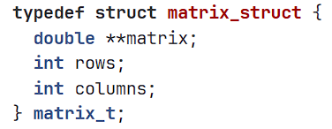

# Matrix

## Содержание

1. [О проекте](#о-проекте)
2. [Особенности проекта](#особенности-проекта)
3. [Makefile](#makefile)

## О проекте

В данном учебном проекте "Школы 21" была реализована библиотека s21_matrix.h для обработки числовых матриц на языке C (стандарта 11).

### Список возможностей библиотеки:

Основополагающая структра матрицы проекта состоит из полей, содержащих целочисленные переменные количества строк и столбцов матрицы, а также указатель на двумерный массив типа double, где хранятся значения матрицы.

*Структура матрицы*

В проекте реализованы операции над матрицами, которые могут возвращать результат выполнения кода (кроме сравнения) в виде:
* **0** - при успешном выполнении операции;
* **1** - при некорректном выполнении операции;
* **2** - были допущены ошибки вычисления.

Список возможных операций над матрицами в рамках проекта:
* создание матриц;
* очистка и уничтожение матриц;
* сравнение двух матриц;
* сложение матриц;
* умножение двух матриц, умножение матрицы на число;
* транспонирование;
* вычисление детерминанта (определителя) матрицы;
* вычисление матрицы алгебраических дополнений;
* создание обратной матрицы на основе текущей.

## Особенности проекта

В рамках учебного проекта неоходимо было соответствовать следующим требованиям:

* Библиотека разработана в соответствии с принципами структурного программирования;
* Использование компилятора gcc;
* При написании кода необходимо придерживаться Google Style;
* Использования префикса "s21_" в названии каждой функции; 
* Функции библиотеки полностью покрываются unit-тестами (используется библиотека Check);
* Проверяемая точность дробной части - максимум до 6 знаков после запятой.

## Makefile

Makefile проекта содержит следующие цели:

&nbsp;&nbsp;&nbsp;&nbsp;``all`` - включает в себя цели clean, s21_matrix.a, test, gcov_report;

&nbsp;&nbsp;&nbsp;&nbsp;``test`` - Запускает unit-тесты на проверку функций библиотеки s21_matrix.h с помощью библиотеки Check;

&nbsp;&nbsp;&nbsp;&nbsp;``s21_matrix.a`` - создание статической библиотеки на основе объектного файла s21_matrix.o;

&nbsp;&nbsp;&nbsp;&nbsp;``gcov_report`` - генерация html-отчета с помощью lcov для измерения покрытия кода тестами;

&nbsp;&nbsp;&nbsp;&nbsp;``check`` - анализирует код на стилистические нормы;

&nbsp;&nbsp;&nbsp;&nbsp;``clean`` - удаляет файлы, созданные во время прохождения тестов, отчеты о покрытии, объектные файлы.